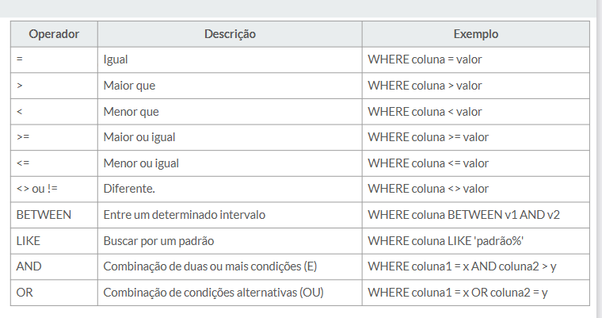

// Data: 07/08/2026
# Ajustar Repositório
instalar mysql pc

# Comandos SQL
## INSERT
ex slide 09 
INSERT into autor(nome, nacionalidade, ano_nascimento)
values("heryson", "brasileiro", 1939);

insert into autor
values(NULL, "TADEU", "brasileiro", 1903);

-- Recuperando as informações
Select * from autor;

-- editora
Insert into editora(nome, cidade, site, ano_fundacao)
values("Comapnhia das letras", "são paulo", "www.cdl.br", 1986), ("Penguin", "londres", "www.pg.ldl", "1935")

insert into livro (isb, titulo, ano_publicacao, fk_id_autor, fk_id_editora)

## Select
Select -- lista de atributos
FROM -- lista de tabelas
WHERE -- CONDIÇAO

Select L.titulo, l.ano_publicacao
FROM LIVRO AS L
WHERE l.titulo LIKE "%Dom%";

### Operadores WHERE
